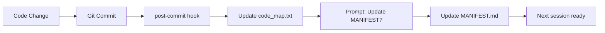

# Context Insight Management System

## Overview

Session context is lost. Long documents burden recovery. Insights must be structured for efficient retrieval.

**Core principle:** Separate key records (brief index) from detailed records (full content). AI reads index first, then loads details on demand.

**Violating the separation of concerns is violating efficient context management.**

## The Iron Law

```
NO INSIGHT WITHOUT PROPER STRUCTURING FIRST
```

If you produce insight worth remembering, structure it immediately.

Don't dump everything into main task documents. Don't mix summary with detail.

---

# Part 1: Project Manifest (Hot Data)

## What is Project Manifest?

The **MANIFEST.md** is the single source of truth for current project state. It contains:

- Current status (what we are doing NOW)
- Active decisions (what we decided RECENTLY)
- Blockers and questions (what's holding us back)
- Next actions (what we will do NEXT)

## Manifest Template

```markdown
# Project Manifest: {Project Name}

**Last Updated**: YYYY-MM-DD HH:MM
**Session Context**: {brief context description}

---

## Current State

| Aspect | Status |
|--------|--------|
| Phase | {Planning/Implementation/Testing/Review} |
| Focus | {What we are working on NOW} |
| Blocker | {If any} |

---

## Active Decisions (Last 7 Days)

| Date | Decision | Rationale |
|------|----------|-----------|
| YYYY-MM-DD | {Decision made} | {Why} |

---

## Current Questions

| ID | Question | Status |
|----|----------|--------|
| Q1 | {Open question} | Open/Resolved |

---

## Next Actions

- [ ] {Action 1} - {Owner}
- [ ] {Action 2} - {Owner}

---

## Key Files Being Modified

```
{path/to/file1} - {what we are doing}
{path/to/file2} - {what we are doing}
```

---

## Context Links

- Task document: `ai-docs/current/{task}/{task}.md`
- Insights index: `.context/insights/{task}.txt`
- Code map: `.context/code_map.txt`
```

## Manifest Usage

```bash
# When starting session
cat ai-docs/current/{task}/MANIFEST.md

# When making decisions
vim ai-docs/current/{task}/MANIFEST.md
# Add decision to Active Decisions section

# When context resume is needed
# Just read MANIFEST.md + task document
```

---

# Part 2: Three-Layer Documentation Structure

## Structure Overview

```
ai-docs/current/{task}/
├── MANIFEST.md                  # L0: Hot Data (current state)
├── README.md                    # L1: Summary (~100 lines)
├── {task}.md                    # L2: Full document (300-600 lines)
└── insights/                    # L3: Deep insights
    ├── insight_01.md
    └── insight_02.md
```

## Layer Specifications

| Layer | File | Lines | Update Frequency | Purpose |
|-------|------|-------|------------------|---------|
| L0 Hot | MANIFEST.md | <100 | Every session | Current state snapshot |
| L1 Summary | README.md | ~100 | On completion | Quick overview |
| L2 Full | {task}.md | 300-600 | Continuous | Complete reference |
| L3 Deep | insights/*.md | 50-100 each | As needed | Specific topics |

---

# Part 3: Insight Records

## When to Create Insights

**Use when:**
- Deep analysis reveals non-obvious patterns
- Technical decisions are made
- Biological interpretations emerge
- Questions about methodology arise
- Complex concepts need explanation

**Especially when:**
- "I'll remember this" (you won't)
- "This is important context" (then structure it)
- User asks "why did we do X?" (should be in insights)
- Session resume requires loading 100+ lines (too much)

**Don't use for:**
- Trivial findings (obvious from code)
- Temporary discussions (throwaway)
- Pure code changes (use git commit)

## Three-Part Insight Structure

```
ai-docs/
├── .context/insights/
│   └── {task_name}.txt          # Part 1: Key Records (brief index)
├── current/{task_name}/
│   ├── insights/                 # Part 2: Detailed Records
│   │   ├── insight_01.md
│   │   └── ...
│   └── {task_name}.md           # Part 3: Main Document (simplified)
└── templates/
    └── insight-template.md       # Template for new insights
```

### Part 1: Key Records Index (.txt)

**Format:** Simple, human-readable, AI-parseable

```text
# {Task Name} - Key Insight Index
# Last updated: YYYY-MM-DD

[insight_id]
Title: {Brief title}
Summary: {One-sentence takeaway, can span multiple lines}
Keywords: {tag1, tag2, tag3}
Detail: current/{task}/insights/{insight_id}.md
Created: YYYY-MM-DD
Related: {path/to/related/file.pdf}
Status: {draft|done|todo}
Priority: {high|medium|low}
```

### Part 2: Detailed Records (.md)

**Format:** Markdown with frontmatter

```markdown
---
title: {Insight Title}
id: {unique_id}
created: YYYY-MM-DD
tags: {tag1, tag2}
status: {draft|done|todo}
---

## Core Question/Conclusion

{One-sentence summary}

## Background

{Why this insight matters}

## Detailed Content

{Full explanation with examples, tables, diagrams}

## Key Findings

1. {Finding 1}
2. {Finding 2}

## Related Files

- {file_path}: {purpose}

---
Last updated: YYYY-MM-DD
```

## Workflow

### Creating a New Insight

```bash
# 1. Create detailed record from template
cp ai-docs/templates/insight-template.md \
   ai-docs/current/{task}/insights/{new_insight}.md
vim ai-docs/current/{task}/insights/{new_insight}.md

# 2. Update key records index
vim ai-docs/.context/insights/{task}.txt
# Add new [insight_id] block

# 3. Update main document (optional)
vim ai-docs/current/{task}/{task}.md
# Add row to insights table

# 4. Commit
git add ai-docs/
git commit -m "docs: add insight {title}"
```

### AI Session Recovery

```bash
# Step 1: Read hot data (MANIFEST.md)
cat ai-docs/current/{task}/MANIFEST.md

# Step 2: Read key records index
cat ai-docs/.context/insights/{task}.txt

# Step 3: Read main document overview
cat ai-docs/current/{task}/{task}.md

# Step 4: Load specific insights on demand
# When user asks about X, load insights/{relevant_id}.md
```

---

# Part 4: Five Optimization Directions

## 1. Hot vs Cold Data Separation

**Principle:** Separate frequently accessed data from archival data.

**Hot Data** (access every session):
- MANIFEST.md - current state, decisions, next actions
- Active code map - what we are working on NOW

**Cold Data** (access rarely):
- Archived insights - past decisions
- Old task documents - completed work

**Implementation:**
```bash
# Keep hot data at root
ai-docs/current/{task}/MANIFEST.md

# Keep cold data in subdirectories
ai-docs/current/{task}/insights/archive/
```

## 2. Incremental Context Loading

**Principle:** Load only what you need, when you need it.

**Progressive Loading Strategy:**
1. Start with MANIFEST.md (30 seconds)
2. Load code map IF needed (1 minute)
3. Load specific insights IF needed (on-demand)

**Don't:** Load all insights at session start
**Do:** Load insights when topic is mentioned

## 3. Self-Correction Loop

**Principle:** System validates and updates itself.

**Loop Components:**
```bash
# 1. On commit - update code map
.git/hooks/post-commit:
  -> ai-docs/.context/scripts/update-context.sh --code-map

# 2. On insight creation - validate index
templates/new-insight.sh:
  -> Check if entry exists in index
  -> Auto-add if missing

# 3. On session end - prompt manifest update
# AI prompts: "Should we update MANIFEST.md with today's decisions?"
```

## 4. Traceability Signatures

**Principle:** Every insight tracks its origin.

**Required Fields:**
```yaml
---
script: {script_path}           # Where this came from
commit: {git_commit_hash}       # Code version
data_version: {data_version}    # Data snapshot
reproducible: {command}         # How to recreate
---
```

**Implementation:**
```bash
# Wrapper script for analysis
scripts/wrap-analysis.sh analysis.R
# Auto-captures:
# - Current git commit hash
# - Script path
# - Timestamp
# Generates insight with pre-filled signatures
```

## 5. Documentation Consolidation

**Principle:** Single source of truth, no redundancy.

**Before:** README.md, QUICKREF.md, USAGE.md, DEPLOY.md (redundant)
**After:** CORE_SKILLS.md (single comprehensive document)

**Consolidation Strategy:**
| Old File | Destination | Action |
|----------|-------------|--------|
| README.md | CORE_SKILLS.md | Merge and delete |
| QUICKREF.md | CORE_SKILLS.md (Quick Reference section) | Merge and delete |
| USAGE.md | CORE_SKILLS.md (Usage section) | Merge and delete |
| DEPLOY.md | CORE_SKILLS.md (Deployment section) | Merge and delete |

---

# Part 5: Quick Reference

## Common Workflows

| I want to... | Do this |
|--------------|---------|
| Start new session | Read `current/{task}/MANIFEST.md` |
| Create new insight | `cp templates/insight-template.md insights/{id}.md` |
| Find specific insight | `cat .context/insights/{task}.txt` |
| Update context | `./update-context.sh --all` |
| Archive task | `./archive-task.sh "{task}"` |

## Naming Conventions

### Insight IDs
Use lowercase with underscores:
- `delta_rho` (not Delta-Rho or deltaRho)
- `pathway_heatmap` (not PathwayHeatmap)
- `missing_deg` (not missing_DEG)

### Index Files
Match task name:
- Task: `PLA2G2A_CAF表型分析`
- Index: `ai-docs/.context/insights/PLA2G2A_CAF.txt`

## Checklist

When creating an insight:
- [ ] Created detailed `.md` file from template
- [ ] Wrote clear summary (one sentence, can be multi-line)
- [ ] Added searchable keywords
- [ ] Updated index `.txt` file
- [ ] Updated main document table (optional)
- [ ] Committed to git
- [ ] Insight ID follows naming convention
- [ ] Related files are linked
- [ ] Traceability signatures filled (if applicable)

---

# Part 6: State Loop Workflow

## The Self-Correction Loop



## Implementation

**File: `.git/hooks/post-commit`**
```bash
#!/bin/bash
# Auto-update code map on commit
ai-docs/.context/scripts/update-context.sh --code-map

# Prompt for manifest update
echo "Consider updating MANIFEST.md with today's decisions"
```

**File: `ai-docs/templates/new-insight.sh`**
```bash
#!/bin/bash
# Validate and update index on insight creation
INSIGHT_ID=$1
TASK=$2

# Check if index exists
if ! grep -q "[$INSIGHT_ID]" .context/insights/$TASK.txt; then
    echo "Warning: Insight not in index. Adding..."
    # Auto-add template entry
fi
```

---

# Part 7: Deployment

## Quick Start (New Project)

```bash
# 1. Copy skill to ~/.claude/
cp context-insight.md ~/.claude/

# 2. Deploy to project
bash ai-docs/deploy-context-system.sh

# 3. Initialize first task
cd ai-docs/templates
./new-task.sh "First Task" "Your Name"
```

## Migration (Existing Project)

```bash
# 1. Consolidate documentation
# Merge README/QUICKREF/USAGE/DEPLOY into CORE_SKILLS.md

# 2. Create MANIFEST.md for current task
cp ai-docs/templates/manifest-template.md \
   ai-docs/current/{task}/MANIFEST.md

# 3. Update insight templates with traceability
cp ai-docs/templates/insight-template.md \
   ai-docs/templates/insight-template.md.old
# (new template has signatures)
```

---

## Examples

### Good Insight

```text
[delta_rho]
Title: Delta rho的含义解析
Summary: Delta rho不是比较表达量，而是比较相关性强度。
       揭示了4种基因调控模式：饱和型、阈值激活型、
       抑制解除型、负反馈型。
Keywords: delta_rho, correlation, comparison, 饱和曲线
Detail: current/PLA2G2A_CAF表型分析/insights/delta_rho.md
Created: 2026-01-18
```

### Good MANIFEST

```markdown
# Project Manifest: CAF Trajectory Analysis

**Last Updated**: 2026-01-20 14:30
**Session Context**: Continuing PLA2G2A CAF phenotype analysis

---

## Current State

| Aspect | Status |
|--------|--------|
| Phase | Implementation |
| Focus | Processing trajectory results |
| Blocker | None |

---

## Active Decisions (Last 7 Days)

| Date | Decision | Rationale |
|------|----------|-----------|
| 2026-01-18 | Use Slingshot for trajectory | Better handles branch points |
| 2026-01-19 | Focus on CAF subtypes only | Epithelial cells contaminated |

---

## Next Actions

- [x] Run Slingshot trajectory analysis
- [ ] Extract DEGs along branches
- [ ] Validate with pathway analysis
```

---

**Remember: Structure first, write second. Hot data accessible, cold data archived.**
